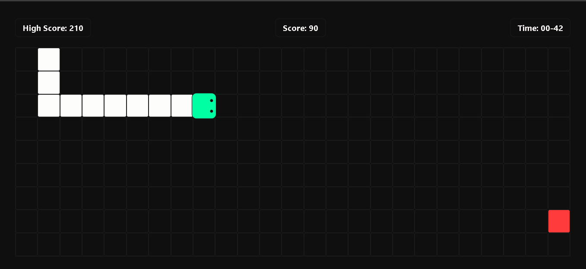

# 🐍 Snake Game – HTML / CSS / JavaScript

A classic Snake Game built purely with Vanilla JavaScript, featuring modern UI, mobile controls, food animation and high score system. Designed to be lightweight, fast, and mobile friendly.


## 📸 Game Preview




## ✨ Features

✔ High Score stored in LocalStorage
✔ Food spawn safe (never inside snake)
✔ Self-collision detection
✔ Reverse direction blocking
✔ Game timer
✔ Food eating animation 🔥
✔ Snake head with moving eyes 👀
✔ Mobile swipe controls
✔ On-screen D-pad (bottom-right)
✔ Fully responsive


## 🎮 Controls

### Desktop

| Action     | Key  |
| ---------- | ---- |
| Move Up    | ▲, W |
| Move Down  | ▼, S |
| Move Left  | ◄, A |
| Move Right | ►, D |

### Mobile

* Swipe on the board
* OR use the screen D-pad

## 🧠 How It Works

* Snake moves continuously on grid
* Food increases snake length
* Score = +10 per food
* Game ends if snake hits wall or itself
* High score saved using LocalStorage


## 🛠️ Tech Stack

* **HTML**
* **CSS**
* **JavaScript (Vanilla)**

No frameworks. No libraries. Just clean code.


## 📂 Project Structure

```
snake-game/
 ├─ index.html
 ├─ style.css
 ├─ script.js
 ├─ assets/
 │   └─ screenshot.png
```


## 🚀 Live Demo

👉 Live Demo: [Click Here](https://cyberfortify.github.io/snake-game) 


## 🧑‍💻 Author

**Aditya Vishwakarma**
Python Developer | Web Developer

🔗 Portfolio: [Portfolio](https://imadityavk.vercel.app)
🔗 LinkedIn: [LinkedIn](https://linkedin.com/in/imadityavk)


## ⭐ Like this project?

Please consider giving it a ⭐ on GitHub — it really motivates 😊
